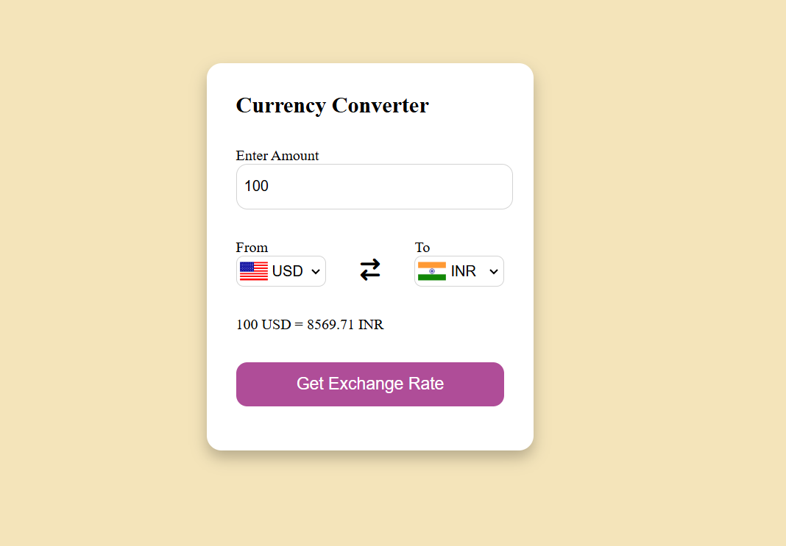

# 💱 Real-Time Currency Converter

A simple and interactive web-based currency converter built with **HTML**, **CSS**, and **JavaScript**. It fetches real-time exchange rates using the [Fawaz Ahmed Currency API](https://github.com/fawazahmed0/currency-api).

---

## 🌍 Features

- 🌐 Convert any currency to another instantly
- 🏳️ Country flags shown for selected currencies
- 📡 Real-time exchange rates using public API
- 💡 Input validation for user-friendly experience
- 📱 Fully responsive and clean UI

---

## 🚀 Live Demo

> [View Live]( https://githubdhruv590.github.io/Currency-Converter/)  

---

## 🛠️ Technologies Used

- HTML5
- CSS3
- JavaScript (Vanilla)
- [Fawaz Ahmed Currency API](https://github.com/fawazahmed0/currency-api)
- [Flags API](https://flagsapi.com)

---

## 📸 Screenshot

  

---

## 📂 How to Run Locally

```bash
git clone https://github.com/Githubdhruv590/Currency-Converter.git
cd Currency-Converter
open index.html in browser
